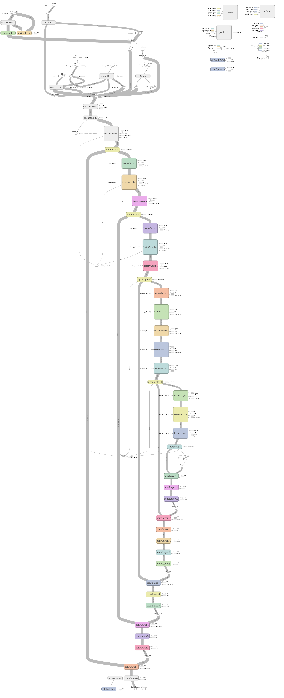
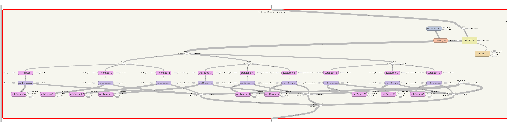
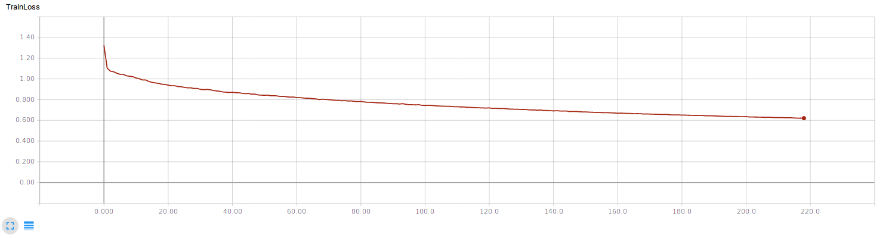
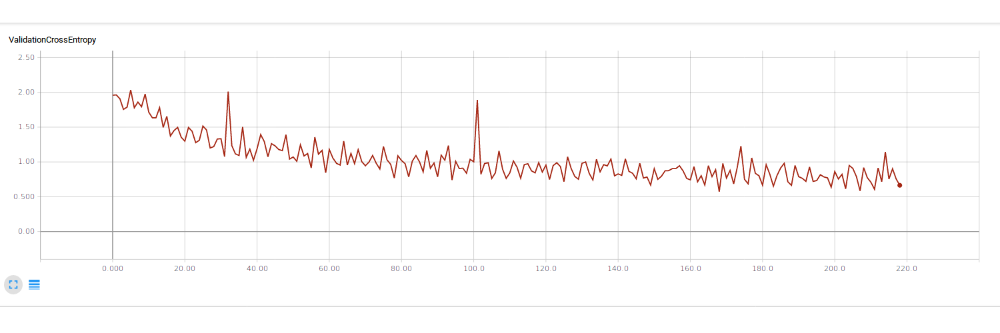
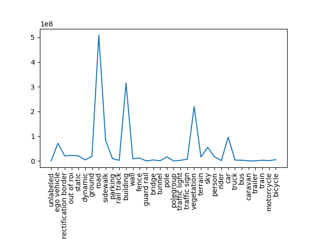
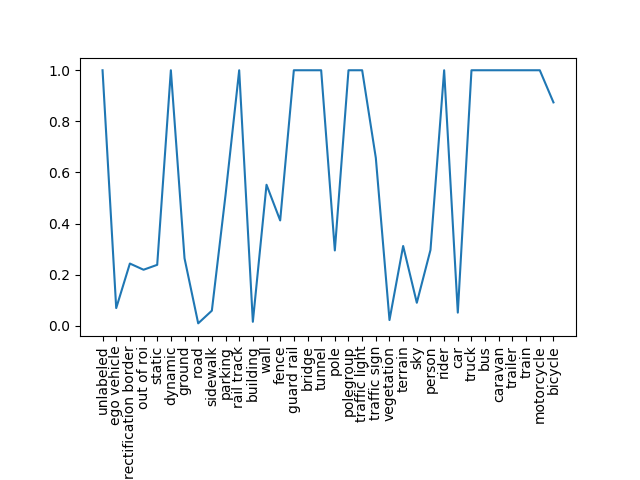

## CarND Semantic Segmentation Project

### Overall Structure:

This is my solution for the semantic segmentation project of the Self Driving Car Nano Degree.
It does not fulfil all the rubric points, as it is utilising YOLOv2 for feature extraction. Therefore loading VGG16 is not necessary.
The network has the following structure:

As visible, the network utilises 16 of the 19 YOLOv2 layers. This allows a good feature, while avoiding some of the memory costly last layers. 

In addition, it is visible that the network contains 4 skip connections. One after each bootleneck layer of the YOLO network and one before the first bootleneck layer. These skip connections are concatenated to the deconvoluted features, as this allows a higher model complexity compared to simply addin those features.

The deconvolution network is basically build like the convolution one with the exception of the bottleneck layers. On the deconvolution side those are splitting the features into nine nearly equally sized patches. Each of these patches is deconvoluted with its own weights. The reasoning behind this is that each of this patches contains different classes in street scenes as there is no symetry axes in the images. (There is kind of a vertical one, but as the car is not driving in the middle of the road the shapes are not symetric.) This splitting allows different weighting in different locastions of the image, while not increasing the complexity of the model to much.  

In addition, after every upsmapling the dimension is checked and, if different from the expected size, zero padding is added to allow concatenation with the skip connections.

After deconvoluting all the features to the original image size, two losses are determined:
- The sparse softmax cross entropy for each of the pixels
- The IMU after taking the argmax for each of the pixels

Each pixel is hereby weighted according to the frequency of occurence of its class. The exact derivation of the weights is explained later. 

Additionaly, there is a loss added from all deconvolutions in the bottleneck layers. This loss is determined by adding autoencoders to each of the deconvolutions. This allows faster training and ensures that the bottlenecks keep as much of the input information as possible.

### Training parameters:

The model is trained with an Adam optimizer with a learning rate of 5e-4. The training is done in batches of just one image as everything leads to out of memory errors even on a GTX 1080. During each epoch 1024 images are used for training and 128 for validation. The training process has two stop arguments. One is that a maximum of 500 epochs are done, the other is, that there has to be a decrement of 0.001 in the validation cross entropy within the last 50 epochs.

The training curve looks the following:

The validation cross-entropy such:

#### Weights:
The frequency of occurence is quite different for the different class, as it can be seen here:

Therefore, the classes where weighted by 5e6/val if val > 5e6 else 1. This reduces the gradients for all often occuring classes, while not leading to excessive gradients for raerly occuring ones. The weights are then:

### Results: 

The results for all the kitty road data can be found in `./gt_image_2`. A good example is:

It can be seen, that all classes are seperated really well.
This is quite stonishing, when taking into account that the network was trained using a subsampled verison of the cityscapes dataset, with 1024x512 pixels and the inference for the kitty data was done by reshaping them to 1024x512 pixels, doing inference and reshaping the result back to the original size. (The process is shown in processKittyData.py). 

### Possible Improvements:

The IMU does not seem to contribute good gradients to the trianing process, therefore it can be removed and more weighting can be given to the cross entropy. 

The valdiation cross-entropy is oscillating a lot. For a better estimate the number of validation examples should be increased. 

Just reshaping the kitty data, applying the network and shaping it back is a really lazy way of applying it. This could be improved a lot.

The number of patches within the deconvolution bottlenecks could be changed to allow higher flexibility. In addition, it should be determined what the best trade of between complexity and resource consumption is. However, I couldn't find such layers in the literature, so just went for 3x3, as I was running out of VRAM. As soon as I have, I will determine an optimum.

 

